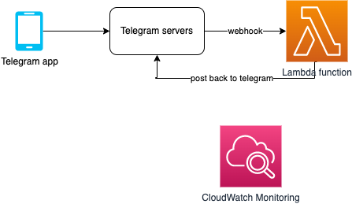

# Telegram-Bot-AWS-Serverless

This project contains source code and supporting files for a [Python Telegram Bot](https://python-telegram-bot.readthedocs.io/en/stable/) serverless application, using [Webhooks](https://github.com/python-telegram-bot/python-telegram-bot/wiki/Webhooks), that you can deploy with the AWS SAM CLI.

# Versions
- Python 3.9
- python-telegram-bot 13.13

# Architecture
Requests come in via the [Lambda Function URL](https://aws.amazon.com/blogs/aws/announcing-aws-lambda-function-urls-built-in-https-endpoints-for-single-function-microservices/) endpoint, which get routed to a Lambda function. the Lambda function runs and posts back to Telegram. Logs are stored on CloudWatch.


It includes the following files and folders.

- ptb_lambda.py - Code for the bot's Lambda function. It echos back whatever text is sent to the bot.
- events - Invocation events that you can use to invoke the function.
- tests - Unit tests for the application code.
- data - Data loaded to S3 bucket
- ruta_archivos.xlsx - Data paths
- template.yaml - A template that defines the application's AWS resources.
- requirements.txt - which pins the version of python-telegram-bot.


The application uses several AWS resources, including a Lambda function and a Lambda Function URL HTTPS endpoint as a Telegram webhook. These resources are defined in the `template.yaml` file in this project. You can update the template to add AWS resources through the same deployment process that updates your application code.

## Deploy the application

- Create your bot using [BotFather](https://core.telegram.org/bots#6-botfather), and note the token, e.g. 12334342:ABCD124324234
- Install AWS CLI, and configure it


The Serverless Application Model Command Line Interface (SAM CLI) is an extension of the AWS CLI that adds functionality for building and testing Lambda applications.

To use the SAM CLI, you need the following tools.
* AWS CLI - [Install the AWS CLI](https://docs.aws.amazon.com/cli/latest/userguide/getting-started-install.html)
* SAM CLI - [Install the SAM CLI](https://docs.aws.amazon.com/serverless-application-model/latest/developerguide/serverless-sam-cli-install.html)
* [Python 3 installed](https://www.python.org/downloads/)

## AWS CLI
Configure AWS CLI

Run this command to quickly set and view your credentials obtained from AWS IAM.
```bash
aws configure
```

You can view and edit your settings by directly editing the config and credentials files.
```bash
nano ~/.aws/credentials
nano ~/.aws/config
```

## S3 Bucket
Create bucket.

`NOTE`: From now on, all commands are executed from the project root folder.
```bash
aws s3 mb s3://resources-bot-artf
```
Load the resources and paths of the documents that feed the bot.
```bash
aws s3 cp data s3://resources-bot-artf/data --acl public-read --recursive
aws s3 cp ruta_archivos.xlsx s3://resources-bot-artf --acl public-read
```
If you want delete buncked
```bash
aws s3 rb s3://resources-bot-artf
```
## AWS Systems Manager

Create an SSM Parameter to store the Telegram token, replace `12334342:ABCD12432423` with your tocken.
```bash
aws ssm put-parameter --region us-east-1 --name "/telegramartfbot/telegram/bot_token" --type "SecureString" --value "12334342:ABCD12432423" --overwrite
```
## AWS CloudFormation

To build and deploy your application for the first time, run the following in your shell:

```bash
sam build
sam deploy --guided
```

The first command will build the source of your application. The second command will package and deploy your application to AWS, with a series of prompts:

* **Stack Name**: The name of the stack to deploy to CloudFormation. This should be unique to your account and region, and a good starting point would be something matching your project name.
* **AWS Region**: The AWS region you want to deploy your app to.
* **Confirm changes before deploy**: If set to yes, any change sets will be shown to you before execution for manual review. If set to no, the AWS SAM CLI will automatically deploy application changes.
* **Allow SAM CLI IAM role creation**: Many AWS SAM templates, including this example, create AWS IAM roles required for the AWS Lambda function(s) included to access AWS services. By default, these are scoped down to minimum required permissions. To deploy an AWS CloudFormation stack which creates or modifies IAM roles, the `CAPABILITY_IAM` value for `capabilities` must be provided. If permission isn't provided through this prompt, to deploy this example you must explicitly pass `--capabilities CAPABILITY_IAM` to the `sam deploy` command.
* **Save arguments to samconfig.toml**: If set to yes, your choices will be saved to a configuration file inside the project, so that in the future you can just re-run `sam deploy` without parameters to deploy changes to your application.


For future deploys, you can just run:

```bash
sam build && sam deploy
```

You can find your Lambda Function URL Endpoint in the output values displayed after deployment.  e.g. `https://1fgfgfd56.lambda-url.eu-west-1.on.aws/`

Update your [Telegram bot to change from polling to Webhook](https://xabaras.medium.com/setting-your-telegram-bot-webhook-the-easy-way-c7577b2d6f72), by  curl'ing it:

curl -F 'url=https://<API_URL>/bot' https://api.telegram.org/bot<BOT_TOKEN>/setWebhook
```bash
curl -F 'url=https://1fgfgfd56.lambda-url.us-east-1.on.aws/bot' https://api.telegram.org/bot12334342:ABCD124324234/setWebhook
```
or pasting this URL in your browser
`https://api.telegram.org/bot12334342:ABCD124324234/setWebHook?url=https://1fgfgfd56.lambda-url.eu-west-1.on.aws/.`


Use your bot token and Lambda Function URL endpoint. You can check that it was set correctly by going to `https://api.telegram.org/bot12334342:ABCD124324234/getWebhookInfo`, which should include the url of your Lambda Function URL, as well as any errors Telegram is encounterting calling your bot on that API.


## Use the SAM CLI to build and test locally

Build your application with the `sam build --use-container` command.

```bash
sam build --use-container
```

The SAM CLI installs dependencies defined in `ptb/requirements.txt`, creates a deployment package, and saves it in the `.aws-sam/build` folder.

Test a single function by invoking it directly with a test event. An event is a JSON document that represents the input that the function receives from the event source. Test events are included in the `events` folder in this project.

Run functions locally and invoke them with the `sam local invoke` command.

```bash
sam local invoke PTBFunction --event events/event.json
```

The SAM CLI can also emulate your application's API. Use the `sam local start-api` to run the API locally on port 3000.

```bash
sam local start-api
curl http://localhost:3000/
```


## Add a resource to your application
The application template uses AWS Serverless Application Model (AWS SAM) to define application resources. AWS SAM is an extension of AWS CloudFormation with a simpler syntax for configuring common serverless application resources such as functions, triggers, and APIs. For resources not included in [the SAM specification](https://github.com/awslabs/serverless-application-model/blob/master/versions/2016-10-31.md), you can use standard [AWS CloudFormation](https://docs.aws.amazon.com/AWSCloudFormation/latest/UserGuide/aws-template-resource-type-ref.html) resource types.

## Fetch, tail, and filter Lambda function logs

To simplify troubleshooting, SAM CLI has a command called `sam logs`. `sam logs` lets you fetch logs generated by your deployed Lambda function from the command line. In addition to printing the logs on the terminal, this command has several nifty features to help you quickly find the bug.

`NOTE`: This command works for all AWS Lambda functions; not just the ones you deploy using SAM.

```bash
sam logs -n PTBFunction --stack-name SPTBAWS --tail
```

You can find more information and examples about filtering Lambda function logs in the [SAM CLI Documentation](https://docs.aws.amazon.com/serverless-application-model/latest/developerguide/serverless-sam-cli-logging.html).

## Tests

Tests are defined in the `tests` folder in this project. Use PIP to install the test dependencies and run tests.

```bash
pip install -r tests/requirements.txt --user
# unit test
python -m pytest tests/unit -v
# integration test, requiring deploying the stack first.
# Create the env variable AWS_SAM_STACK_NAME with the name of the stack we are testing
AWS_SAM_STACK_NAME=<stack-name> python -m pytest tests/integration -v
```

## Cleanup

To delete the sample application that you created, use the AWS CLI. Assuming you used your project name for the stack name, you can run the following:

```bash
sam delete
```

## Resources

See the [AWS SAM developer guide](https://docs.aws.amazon.com/serverless-application-model/latest/developerguide/what-is-sam.html) for an introduction to SAM specification, the SAM CLI, and serverless application concepts.
